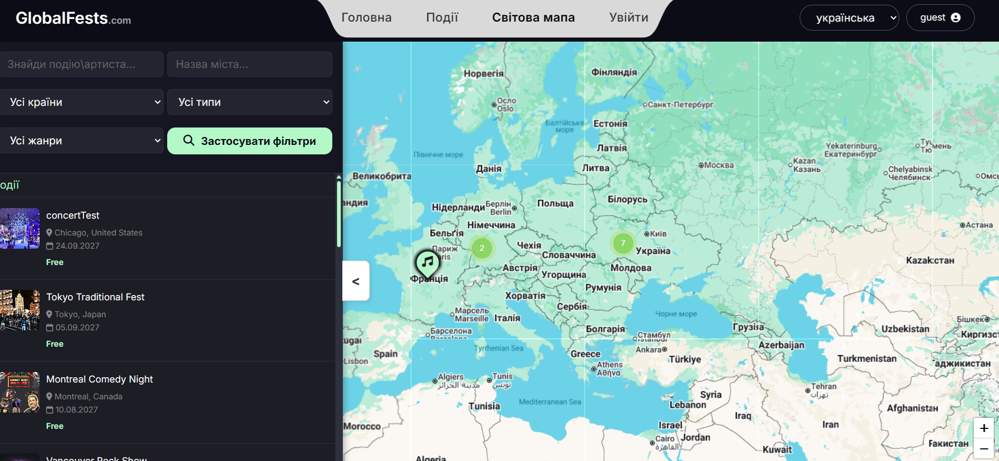
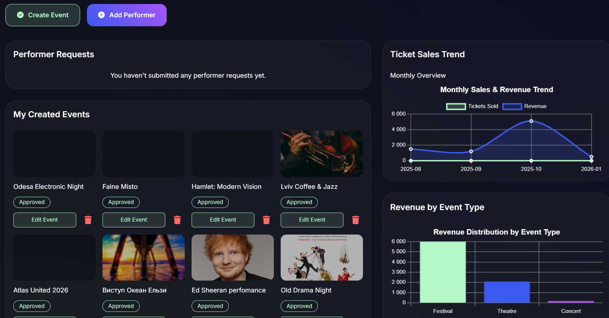

<div align="center">
  <br />
  <!-- Replace with your logo if you have one, or use a text header -->
  <h1 style="font-size: 3rem; font-weight: bold;">🌍 GlobalFests</h1>
  <p>
    <strong>Discover. Experience. Celebrate.</strong>
  </p>
  <p>
    A comprehensive event discovery and management platform built with ASP.NET Core.
  </p>

  <p>
    <a href="#-key-features">Features</a> •
    <a href="#-tech-stack">Tech Stack</a> •
    <a href="#-getting-started">Getting Started</a> •
    <a href="#-screenshots">Screenshots</a>
  </p>

  <!-- Badges -->
  
  
  
  
</div>

<br />

## 📖 About

**GlobalFests** is a modern web application designed to bridge the gap between event organizers and attendees. It features a sleek **Glassmorphism UI**, an interactive world map for event discovery, and a robust role-based system for managing festivals, concerts, and theatre performances globally.

## ✨ Key Features

### 🎧 For Attendees
*   **Interactive World Map:** Discover events geographically using Leaflet.js with custom clustering and filtering.
*   **Advanced Search:** Filter by genre, country, date range, price, and performers with high-performance cursor-based pagination.
*   **Ticketing System:** Seamless checkout process to secure spots at events.
*   **Wishlist & Reviews:** Save favorites and leave feedback/ratings for attended events.
*   **Responsive Design:** Fully optimized mobile experience with an off-canvas navigation drawer.

### 🎹 For Organizers & Admins
*   **Dashboard Analytics:** Visualize sales data, revenue, and ticket trends using SQL stored procedures for performance.
*   **Event Management:** CRUD operations for events, performers, and venues with validation logic.
*   **Moderation:** Admin tools to approve or reject events and manage users.

## 🛠 Tech Stack

| Layer | Technology |
| :--- | :--- |
| **Framework** | ASP.NET Core 8.0 (MVC) |
| **Database** | MS SQL Server |
| **ORM** | Entity Framework Core ( Database-First ) |
| **Architecture** | Repository Pattern, Unit of Work, Service Layer |
| **Frontend** | Razor Views, HTML5, CSS3 (Custom Glassmorphism) |
| **JavaScript** | Leaflet.js (Maps), Swiper.js (Sliders), Flatpickr (Dates) |

## 📸 Screenshots


<div align="center"> 
  
  <p><em>Interactive World Map with Clustering</em></p>
</div>

<br/>

<div align="center" style="display: flex; gap: 10px; justify-content: center;">
  
  
</div>

## 🚀 Getting Started

### Prerequisites
*   [.NET 8.0 SDK](https://dotnet.microsoft.com/download)
*   SQL Server (LocalDB or Express)

### Installation

1.  **Clone the repository**
    ```bash
    git clone https://github.com/mycola23/GlobalFests.git
    cd GlobalFests
    ```

2.  **Configure Database**
    Update `appsettings.json` with your connection string:
    ```json
    "ConnectionStrings": {
      "DefaultConnection": "Server=.;Database=GlobalFestsDB;Trusted_Connection=True;TrustServerCertificate=True;"
    }
    ```

3.  **Run Migrations & Seed Data**
    The project includes a SQL script (`seed_data.sql`) to populate Genres, Countries, and sample Events.
    ```bash
    dotnet ef database update
    # Execute the SQL seed script in SSMS if needed
    ```

4.  **Run the Application**
    ```bash
    dotnet run
    ```
    Visit `https://localhost:7001` in your browser.

## 🗄️ Database Architecture

The system utilizes a relational database with key constraints and indexes for optimization.

*   **Users & Roles:** RBAC system.
*   **Events & Tickets:** Core logic with concurrency handling.
*   **Performers & Genres:** Many-to-Many relationships.
*   **Stored Procedures:** Used for complex analytical queries in the Organizer Dashboard.


## 📄 License

Distributed under the MIT License. See `LICENSE` for more information.

---

<div align="center">
  <p>Made with ❤️ by Mycola </p>
</div>